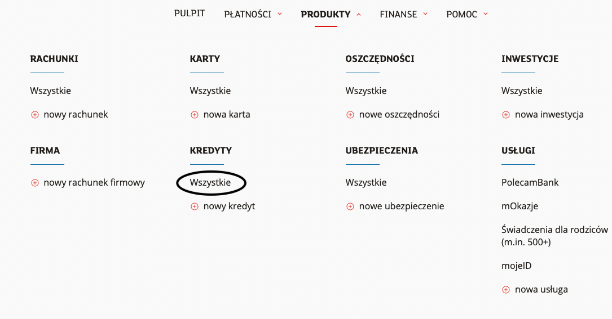
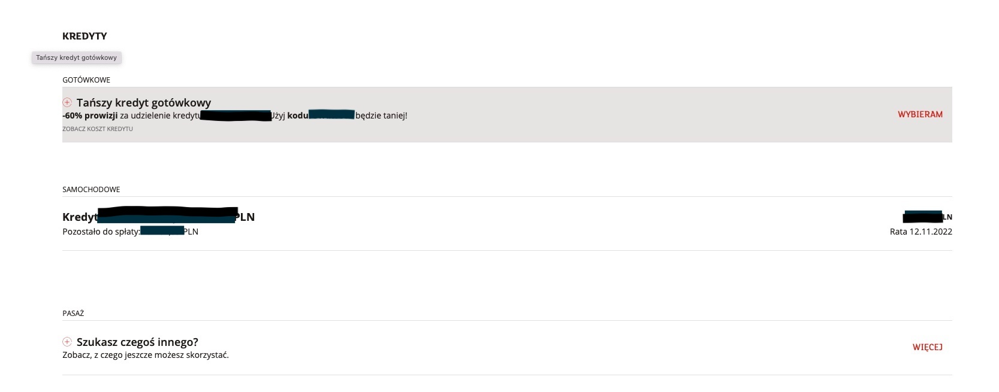
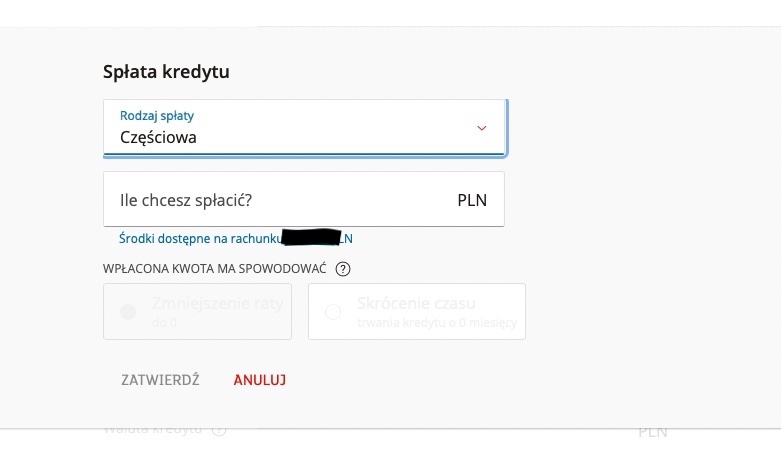
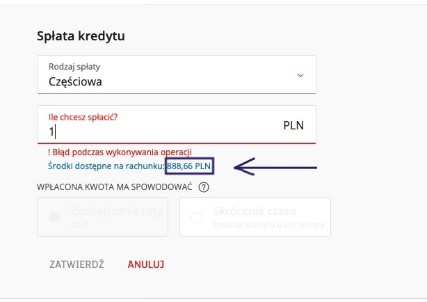
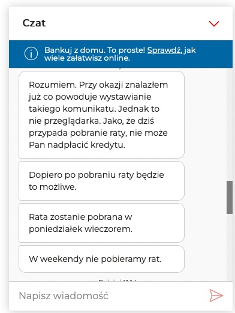

# Znalezione błędy
To miejsce, w którym zamieszczam błędy lub niespójności, które napotkałem podczas codziennego korzystania z dostępnych dla mnie usług. Część z nich z pewnością może być już naprawiona, część po jakiś czasie zdeaktualizuje się. 
Repozytorium służy mi do ćwiczeń z zakresu testowania oprogramowania i aplikacji.

## Spis treści
- [Strona kredytu w mBank](#strona-kredytu-w-mbank)
- [Strona ePłatnik w ZUS](#strona-epłatnik-w-zus)

## Strona kredytu w mBank

**Tytuł: Nieprecyzyjna informacja dla klienta - brak możliwości spłaty kredytu w dniu pobrania raty.**

**Warunki wstępne:**
Wejdź na stronę mbank.pl,, zaloguj się i przejdź do zakładki Produkty -> Kredyty -> Wszystkie.

  

Wybierz kredyt, który chcesz nadpłacić.  

**Kroki:**
Logowanie -> Produkty -> Kredyty -> Wszystkie
Wybierz właściwy kredyt do nadpłaty
Wyświetli się okno kredytu.
W wierszu “Spłać całość kredytu lub część” wybierz tekst po prawej “SPŁAĆ”

Wyświetli się okno kontekstowe. W dropdownie “Rodzaj spłaty” - wybierz “Częściowa” 

W oknie “Ile chcesz spłacić” wybierz dowolną kwotę, nie przewyższającą dostępnego salda. (Wybrałem 1 zł).
Pojawia się komunikat “! Błąd podczas wykonywania operacji”. 

Kolejne klawisze i okna wyboru są niedostępne, aktywna jest tylko opcja: “ANULUJ”.

**Oczekiwany rezultat:**
Zatwierdzenie wpisanej kwoty mieszczącej się w dostępnym saldzie rachunku i finalnia spłata częściowa kredytu.

**Aktualny rezultat:**
Pojawiający się błąd uniemożliwia nadpłatę kredytu. 

**Informacje dodatkowe:**
Jako klient nie jestem informowany o przyczynie błędu, tracę czas na próby znalezienia go po swojej jak i banku stronie. Po konsultacji z mLinią otrzymuję informację, że dziś przypada dzień spłaty raty i w związku z tym nie mogę nadpłacić kredytu. W przypadku weekendu (jest sobota), najbliższa możliwa spłata może się odbyć po pobraniu raty - czyli w poniedziałek. 

Oczekiwałbym zamiast czerwonego komunikatu o błędzie tekstu informacyjnego np.: 
“Ze względów… spłata częściowa lub całkowita możliwa będzie w najbliższym dniu roboczym.”

---
## Strona ePłatnik w ZUS
Przypadek testowy ZUS formularz

Tytuł: Wypełnianie formularza ZZA do ZUS - kopiowanie nr dowodu osobistego	

Warunki wstępne:
Wejdź na stronę pue.zus.pl, zaloguj się i przejdź do zakładki ePłatnik. W zakładce ePłatnik kliknij “Zgłoś ubezpieczonego” w lewym, górnym roku menu. Wyświetli się okno kreatora dodawania ubezpieczonego dla danego płatnika.

Kroki
Logowanie
Dodaj ubezpieczonego
Dalej
w oknie “Zgłoszenie ubezpieczonego » Dane identyfikacyjne i ewidencyjne wpisz poprawne dane
w polu “typ dokumentu” wybierz “dowód osobisty”
skopiuj dane dowodu z innego miejsca w formacie “ABC 123456” i wklej w polu seria i numer dokumentu 
przejdź do kolejnej zakładki.

Oczekiwany rezultat:
Zatwierdzenie prawidłowego numeru dowodu.

Aktualny rezultat:
Wklejając numer w formacie ABC 123456 (między literami a cyframi jest spacja) formularz obcina ostatnią cyfrę tworząc format: „ABC12345”
W wynilu tego pojawia się podczas weryfikacji dokumentu błąd krytyczny. Jest on widoczny dopiero z poziomu kliknięcia okno edycji - podświetla się na czerwono nr dowodu osobistego

